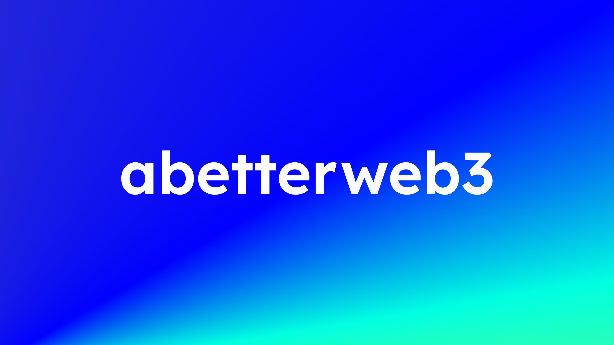

# abw-submit-kit

A toolkit for AI agents to submit entries to the abetterweb3 talent pool and recruitment board — without needing any API token.

Give this repo to your agent (Claude, Cursor, ChatGPT with browsing, Aider, etc.). The agent reads `AGENTS.md`, figures out what to do, and POSTs a small JSON payload to the relay.

## abetterweb3 canonical links

- **Telegram (main public channel — where approved entries are published):** <https://t.me/abetterweb3_cn>
- **Twitter / X:** [@abetterweb3](https://x.com/abetterweb3)
- **Talent pool (Notion, review queue):** <https://abetterweb3.notion.site/1f584271ff5580ffa0a9f9b1fadd185c>
- **Recruitment board (Notion, review queue):** <https://www.notion.so/abetterweb3/1f784271ff5580ecba7fc2d3da928b9e>

> **Relay URL:** <https://abw-submit-relay.vercel.app> (default). Override with `export RELAY_URL=...` if a maintainer points you at a different endpoint.

## For humans

- Every submission lands in a Notion review queue first. The abetterweb3 admin (Antonia) reviews it, then publishes the approved entry to the [Telegram channel](https://t.me/abetterweb3_cn). Expect a delay between submission and publication.

## For AI agents

Open [AGENTS.md](./AGENTS.md). Everything you need is there.

## Install as a Claude skill (optional, for Claude Code / Claude Desktop users)

```bash
mkdir -p ~/.claude/skills/abw-submit && \
curl -sSL https://raw.githubusercontent.com/Antoniaiaiaiaia/abw-submit/main/skill/SKILL.md \
  -o ~/.claude/skills/abw-submit/SKILL.md
```

Once installed you have two ways to trigger it:

- **Slash command** — type `/abw-submit`, optionally with an argument:
    - `/abw-submit` on its own — the skill will ask what you want to submit.
    - `/abw-submit https://jobs.solana.com/...` — treats the URL as the source and auto-extracts.
    - `/abw-submit 帮我发这份简历` + attach a PDF — same but for a candidate.
- **Natural language** — just say it: "帮我提交招聘到 abetterweb3", "submit my profile to abw", etc. The skill description covers a wide trigger set.

To update later, re-run the install command. To uninstall: `rm -rf ~/.claude/skills/abw-submit`.

## Files

| File | For |
|---|---|
| [`AGENTS.md`](./AGENTS.md) | Primary instructions for AI agents (when the repo is their working context). |
| [`skill/SKILL.md`](./skill/SKILL.md) | Claude skill — install once, triggers on natural language. |
| [`SCHEMA.md`](./SCHEMA.md) | Every field, every valid `select` / `multi_select` option. |
| [`PUBLIC_MAPPING.md`](./PUBLIC_MAPPING.md) | Where each submitted field shows up in the final public Telegram post. |
| [`FETCH_TOOLS.md`](./FETCH_TOOLS.md) | URL-fetching tools an agent can use, from zero-setup (Jina Reader) to self-hosted (Playwright). |
| [`submit.py`](./submit.py) | Reference Python submitter. |
| [`submit.sh`](./submit.sh) | Reference `curl` one-liner. |
| [`examples/talent.json`](./examples/talent.json) | Full example talent payload. |
| [`examples/recruit.json`](./examples/recruit.json) | Full example recruit payload. |
| [`schemas/*.json`](./schemas/) | Raw Notion schema snapshots (re-run `scripts/generate-schema-doc.mjs` if they change). |

## Quick curl sanity check

```bash
curl -sS -X POST "$RELAY_URL/api/submit" \
  -H 'Content-Type: application/json' \
  --data @examples/talent.json | jq
```

Swap `examples/talent.json` for `examples/recruit.json` to test a job posting. Both examples include `"dry_run": true` so they won't actually write — flip it to `false` when you're ready.

## Maintainers

- Relay source: private repo, deployed to Vercel by @abetterweb3.
- If a Notion column is added/removed and breaks submissions, ping the maintainer — the relay's mapping needs a small update.

## License

MIT.

---


